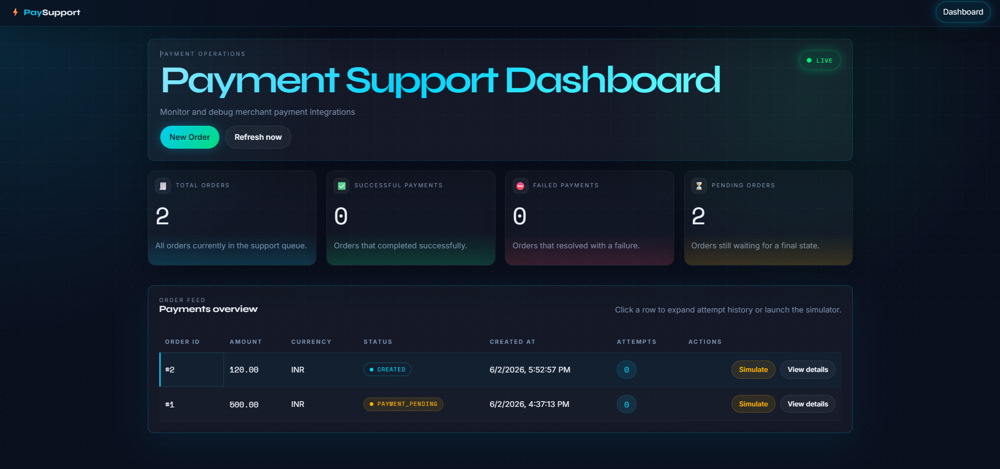

# ⚡ Payment Support Dashboard

A full-stack payment integration support dashboard built for merchant success and integration support engineers in fintech.



## 🎯 What This Project Does

Simulates a real-world merchant payment support tool used to:
- Create merchant orders with amount and currency
- Simulate payment outcomes — SUCCESS, FAILURE, TIMEOUT
- Inspect full transaction history and error codes per order
- Debug payment integration issues through a support dashboard

## 🛠️ Tech Stack

| Layer | Technology |
|---|---|
| Backend | Java 21, Spring Boot 4, Spring Data JPA, Hibernate |
| Database | MySQL 8 |
| Frontend | React 18, Vite, Axios, React Router |
| API Style | RESTful JSON APIs |
| Tools | Maven, Postman, GitHub Copilot, VS Code |

## 🚀 Features

- ✅ Create orders with amount and currency
- ✅ Simulate payment — SUCCESS, FAILURE, TIMEOUT
- ✅ View full payment attempt history per order
- ✅ Real-time stat cards (total, successful, failed, pending)
- ✅ Color-coded status badges with pulse animations
- ✅ Payment attempt timeline on order detail page
- ✅ Toast notifications after each simulation
- ✅ Auto-refresh every 10 seconds
- ✅ Dark fintech UI with glassmorphism design

## 📡 REST API Endpoints

| Method | Endpoint | Description |
|---|---|---|
| GET | `/api/orders` | List all orders |
| POST | `/api/orders` | Create new order |
| GET | `/api/orders/{id}` | Get order with all attempts |
| POST | `/api/orders/{id}/pay?mode=SUCCESS` | Simulate success |
| POST | `/api/orders/{id}/pay?mode=FAILURE` | Simulate failure |
| POST | `/api/orders/{id}/pay?mode=TIMEOUT` | Simulate timeout |

## ⚙️ Local Setup

### Prerequisites
- Java 21
- Maven
- MySQL 8
- Node.js 18+
- npm

### Backend Setup
```bash
# 1. Clone the repo
git clone https://github.com/maniakhilesh/payment-support-dashboard.git
cd payment-support-dashboard

# 2. Create MySQL database
mysql -u root -p
CREATE DATABASE payment_dashboard;

# 3. Configure properties
cd payment-support-backend
cp src/main/resources/application.properties.example src/main/resources/application.properties
# Edit application.properties — add your MySQL password

# 4. Run backend
mvn spring-boot:run
# Backend runs at http://localhost:8080
```

### Frontend Setup
```bash
cd payment-support-frontend
npm install
npm run dev
# Frontend runs at http://localhost:5173
```

## 📁 Project Structure

```
payment-support-dashboard/
├── payment-support-backend/        # Spring Boot backend
│   ├── src/main/java/com/example/demo/
│   │   ├── controller/             # REST controllers
│   │   ├── service/                # Business logic
│   │   ├── repository/             # JPA repositories
│   │   ├── entity/                 # JPA entities
│   │   ├── dto/                    # Request/Response DTOs
│   │   ├── exception/              # Exception handling
│   │   └── config/                 # CORS configuration
│   └── src/main/resources/
│       └── application.properties.example
├── payment-support-frontend/       # React frontend
│   └── src/
│       ├── api/                    # Axios API calls
│       ├── components/             # Reusable components
│       └── pages/                  # Dashboard, OrderDetail
└── README.md
```

## 💡 Key Engineering Decisions

- **H2 for tests, MySQL for production** — test DB is in-memory for speed; production uses persistent MySQL
- **DTOs for API responses** — entities are not exposed directly; separate response objects used
- **CORS configured** — frontend and backend run on different ports; CORS allows secure cross-origin requests
- **ddl-auto: update** — Hibernate auto-creates/updates tables on startup without manual SQL scripts
- **Exception handler** — global `@RestControllerAdvice` returns consistent error responses

## 🔗 Built For

Portfolio project targeting **Merchant Success / Integration Support** roles in fintech.